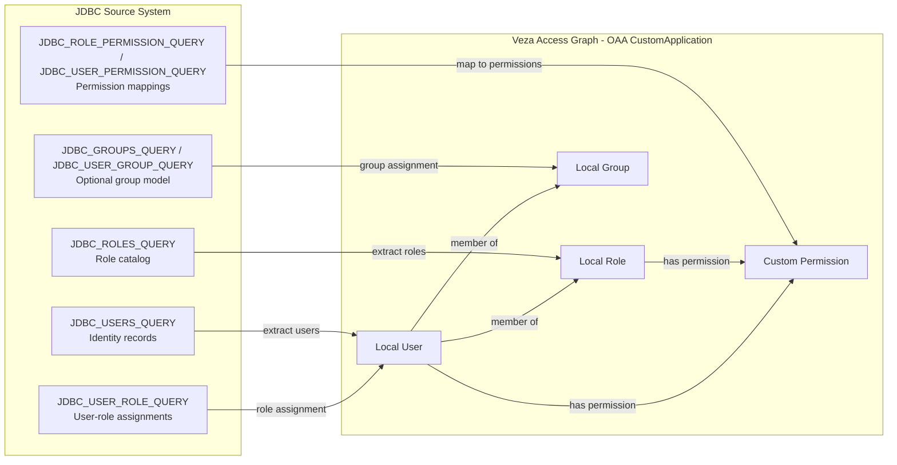

# Generic JDBC Application -> Veza OAA Connector

## 1. Overview
This connector reads identity and access data from any JDBC-accessible application database and pushes it to Veza as a CustomApplication payload.

Entity model:
- Local User: users returned by JDBC_USERS_QUERY
- Local Role: roles returned by JDBC_ROLES_QUERY
- Local Group: optional groups returned by JDBC_GROUPS_QUERY
- Custom Permission: from CUSTOM_PERMISSIONS plus optional role/user permission queries

Default OAA permission mapping:
- read -> DataRead
- write/edit/update/create/delete/manage -> DataRead + DataWrite
- admin/owner/security -> DataRead + MetadataRead + MetadataWrite

## 2. Entity Relationship Map


## 3. How It Works
1. Loads settings from args and .env with precedence args > env > defaults.
2. Opens JDBC connection using DB_JDBC_URL or SQL Server components.
3. Executes required queries (users, roles) and optional relationship queries.
4. Builds a CustomApplication payload with users, roles, groups, and permissions.
5. Saves payload.json if requested.
6. Pushes to Veza.

## 4. Prerequisites
- Linux host with Python 3.9+
- Java runtime and JDBC jar
- Network connectivity to DB host and Veza
- Veza API key with provider push permissions
- Shared JDBC driver cache path: /opt/VEZA/JDBC/drivers

## 5. Quick Start
```bash
curl -fsSL https://raw.githubusercontent.com/<org>/<repo>/main/integrations/jdbc-app-connector/install_jdbc_app_connector.sh | bash
```

## 6. Manual Installation
### RHEL/CentOS/Fedora
```bash
sudo dnf install -y git python3 python3-pip java-17-openjdk-devel
```

### Ubuntu/Debian
```bash
sudo apt-get update
sudo apt-get install -y git python3 python3-pip python3-venv openjdk-17-jdk
```

### Python environment
```bash
cd integrations/jdbc-app-connector
python3 -m venv venv
./venv/bin/pip install -r requirements.txt
cp .env.example .env
chmod 600 .env
```

## 7. Usage
| Argument | Required | Values | Default | Description |
|---|---|---|---|---|
| --data-dir | No | path | ./samples | Compatibility placeholder |
| --env-file | No | path | .env | Env file path |
| --veza-url | Yes | URL | env | Veza URL |
| --veza-api-key | Yes | string | env | Veza API key |
| --provider-name | No | string | JDBC Applications | Veza provider name |
| --datasource-name | No | string | APPLICATION_NAME | Veza datasource name |
| --application-name | No | string | JDBC Application | Display app name |
| --save-json | No | flag | false | Save payload.json |
| --log-level | No | DEBUG/INFO/WARNING/ERROR | INFO | Logging level |
| --db-server | No** | hostname | env | SQL Server host |
| --db-instance | No | string | env | SQL Server instance |
| --db-name | No | string | env | Database name |
| --db-user | Yes | string | env | DB login user |
| --db-password | Yes | string | env | DB login password |
| --db-domain | No | string | env | NTLM domain |
| --db-jdbc-url | No** | JDBC URL | env | Full JDBC URL override |
| --db-jdbc-driver-type | No | mssql/postgresql/mysql/oracle | mssql | Driver package profile |
| --db-jdbc-driver-class | No | Java class | com.microsoft.sqlserver.jdbc.SQLServerDriver | JDBC driver class |
| --db-jdbc-jar | Yes | path | /opt/VEZA/JDBC/drivers/... | JDBC jar path |

Notes:
- Either --db-jdbc-url or --db-server is required.
- Installer scans /opt/VEZA/JDBC/drivers for a compatible driver jar first and reuses it if found.
- If no compatible cached jar exists, installer downloads and validates the expected jar into /opt/VEZA/JDBC/drivers.

Example run:
```bash
cd integrations/jdbc-app-connector
./venv/bin/python3 jdbc_app_connector.py --env-file .env --save-json --log-level DEBUG
```

## 8. Deployment on Linux
- Create service account:
```bash
sudo useradd -r -s /bin/bash -m -d /opt/jdbc-app-connector-veza jdbc-app-connector-veza
```
- Permissions:
```bash
chmod 600 "/opt/VEZA/JDBC/<Application Name>/scripts/.env"
chmod 700 "/opt/VEZA/JDBC/<Application Name>/scripts"
```
- SELinux (RHEL):
```bash
getenforce
sudo restorecon -Rv "/opt/VEZA/JDBC/<Application Name>"
```
- Cron wrapper example:
```bash
#!/usr/bin/env bash
cd "/opt/VEZA/JDBC/<Application Name>/scripts"
"/opt/VEZA/JDBC/<Application Name>/scripts/venv/bin/python3" jdbc_app_connector.py --env-file .env >> ../logs/cron.log 2>&1
```
- Cron schedule:
```bash
0 2 * * * /opt/VEZA/JDBC/<Application Name>/scripts/run_connector.sh
```

## 9. Multiple Instances
Use a separate env file per application instance:
- .env.app1
- .env.app2

Run with:
```bash
./venv/bin/python3 jdbc_app_connector.py --env-file .env.app1
```

## 10. Security Considerations
- Keep env files chmod 600.
- Rotate DB and Veza credentials regularly.
- Avoid embedding secrets in command history.
- Restrict filesystem access to the service account.

## 11. Troubleshooting
- Authentication failures: verify DB_USER, DB_PASSWORD, DB_DOMAIN, DB_JDBC_URL.
- Driver errors: confirm DB_JDBC_JAR path and driver class.
- Empty payload: verify query result columns match configured column mappings.
- Veza push warnings: inspect logs in logs/ and payload.json output.

## 12. Changelog
- v1.0.0: Initial reusable JDBC connector with interactive installer and env-driven SQL model.
